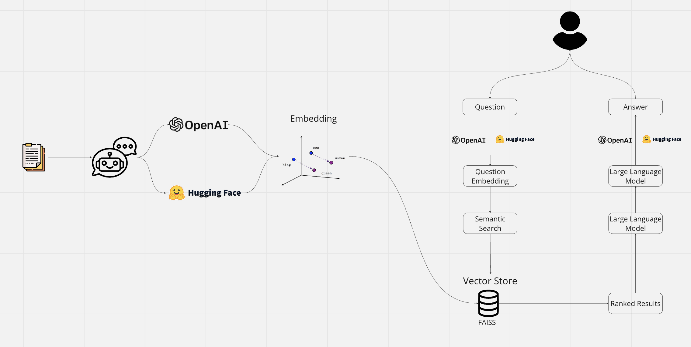
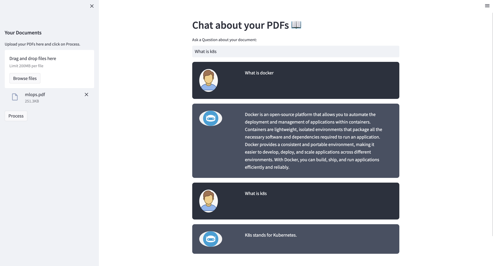

# Chatbot for Multiple PDFs with OpenAI and Hugging Face Models

This project demonstrates the creation of a chatbot using both paid OpenAI models and free and open-source Hugging Face models. 
The chatbot allows users to ask questions about PDF documents and receive relevant responses based on the content of the documents.

## Features

- Upload PDF documents and extract text from them
- Split the extracted text into smaller chunks for processing
- Generate embeddings for the text using OpenAI or Hugging Face models
- Store the embeddings in a vector store
- Utilize conversation chains for chat-based interactions
- Handle user input and provide appropriate responses

## Technologies Used

- Python
- Streamlit: A framework for building interactive web applications
- PyPDF2: A library for extracting text from PDF documents
- dotenv: A module for loading environment variables from a `.env` file
- Hugging Face: A platform for exploring, training, and sharing NLP models
- OpenAI: A company that provides powerful AI models and APIs

## Design Diagram

## Usage

1. Clone the repository:
   `git clone https://github.com/your-username/your-repo.git`
   `cd your-repo`
   
2. Install the required dependencies:
   `pip install -r requirements.txt`

3. Set up your environment variables by creating a `.env` file with the following contents:
   `OPENAI_API_KEY=<YOUR_OPEN_AI_API_KEY>`
   `HUGGINGFACEHUB_API_TOKEN=<YOUR_HUGGINGFACE_API_KEY>`
   Make sure to replace `<YOUR_OPEN_AI_API_KEY>` and `<YOUR_HUGGINGFACE_API_KEY>` with your actual OpenAI API and HuggingFace keys.

4. Run the application:
   `streamlit run app.py`

5. Access the application by opening the provided URL in your web browser.

## Actual Working

## Configuration

To switch between using OpenAI and Hugging Face models, you can modify the relevant sections in the `app.py` file:

- For OpenAI models, uncomment the appropriate lines and comment out the Hugging Face lines.
- For Hugging Face models, uncomment the Hugging Face lines and comment out the OpenAI lines.

You can also experiment with different Hugging Face models by changing the `model_name` parameter in the `HuggingFaceInstructEmbeddings` class instantiation.

Note: Using OpenAI models will will be charged, while Hugging Face models are free and open source.

## License

This project is licensed under the [MIT License](LICENSE).

